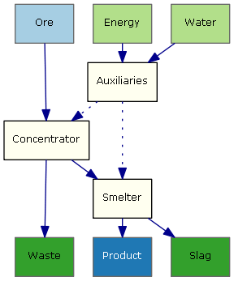
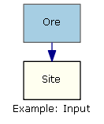

xml-process
===========

A simple xml structure for representing process flows and is used to generate process flow diagrams.

---
* [Examples](#examples)
	* [Crude Oil](#crude-oil)
	* [Gold](#gold)
	* [Magnetite](#magnetite)

* [Elements](#elements)
	* [Input](#input)
	* [Output](#output)
	* [Consumable](#output)
	* [Waste](#waste)
	* [Flow](#flow)
	* [Link](#link)
	
	
Process Flow (top-bottom)          | Process flow (left-right)
-----------------------------------|-----------------------------------
 | 

Xml: [Source](./doc/Examples/MultiSite/ProcessFlow.xml) 
```xml
<ProcessFlow>
	<Area name='Auxiliaries'>
		<Consumable name='Water'/>
		<Consumable name='Energy'/>
		<Consumable name='Energy'/>
		<Link to='Concentrator' />
		<Link to='Smelter' />
	</Area>
	<Area name='Concentrator'>
		<Input name='Ore'/>
		<Waste name='Waste'/>
		<Flow to='Smelter'/>
	</Area>
	<Area name='Smelter'>
		<Waste name='Slag'/>
		<Output name='Product'/>
	</Area>
</ProcessFlow>
```


### Examples
### [Crude Oil](./doc/Examples/CrudeOil)

Source: [xml](./doc/Examples/CrudeOil/ProcessFlow.xml)


### [Gold](./doc/Examples/Gold)

Source: [xml](./doc/Examples/Gold/ProcessFlow.xml)


### [Magnetite](./doc/Examples/Magnetite)

Source: [xml](./doc/Examples/Magnetite/ProcessFlow.xml)


### Elements

Input | Output | Consumable | Waste |
------|--------|------------|-------|
 |  |  |  

Flow | Link
-----|------
 | 

#### Input
Input flow for the process.
 - name = name of the flow
 
Xml: [Source](./doc/Examples/Input/ProcessFlow.xml)
``` xml
<ProcessFlow name='Example: Input'>
	<Area name='Site'>
		<Input name='Ore'/>
	</Area>
</ProcessFlow>
```


#### Output
Output flow for the process.
 - name = name of the flow
 
Xml: [Source](./doc/Examples/Output/ProcessFlow.xml)
``` xml
<ProcessFlow name='Example: Output'>
	<Area name='Site'>
		<Output name='Product'/>
	</Area>
</ProcessFlow>
```


#### Consumable
Consumable flow for the process.
 - name = name of the flow
 
Xml: [Source](./doc/Examples/Consumable/ProcessFlow.xml)
``` xml
<ProcessFlow name='Example: Consumable'>
	<Area name='Site'>	
		<Consumable name='Water'/>
	</Area>
</ProcessFlow>
```


#### Waste
Waste flow for the process.
 - name = name of the flow
 
Xml: [Source](./doc/Examples/Waste/ProcessFlow.xml)
``` xml
<ProcessFlow name='Example: Waste'>
	<Area name='Site'>
		<Waste name='Waste'/>
	</Area>
</ProcessFlow>
```


#### Flow
Generic flow for the process.
to or flow is required.

 - to = Where the flow goes to (name of the area)
 - from = Where the flow comes from (name of the area)
 
Xml: [Source](./doc/Examples/Flow/ProcessFlow.xml)
``` xml
<ProcessFlow name='Example: Flow'>
	<Area name='Site 1'>
		<Flow to='Site 2'/>
	</Area>
	<Area name='Site 2'>
		<Flow to='Site 3'/>
	</Area>
	<Area name='Site 3'>
		<Flow from='Site 1'/>
	</Area>	
</ProcessFlow>
```


#### Link
Link between the two areas.
(@to or @from is required)
 - to = Where the link goes to (name of the area)
 - from = Where the link comes from (name of the area)
 
Xml: [Source](./doc/Examples/Flow/ProcessFlow.xml)
``` xml
<ProcessFlow name='Example: Link between 1 and 3'>
	<Area name='Site 1'>
		<Flow to='Site 2'/>
	</Area>
	<Area name='Site 2'>
		<Flow to='Site 3'/>
	</Area>
	<Area name='Site 3'>
		<Link from='Site 1'/>
	</Area>	
</ProcessFlow>
```


