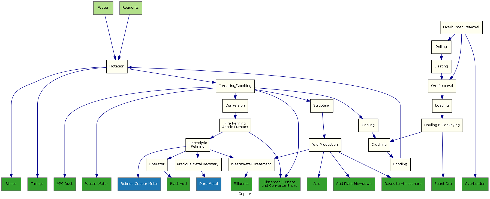

Gold Example
===========

An example showing the copper process
Source: [Chapter 5](http://energy.gov/sites/prod/files/2013/11/f4/copper.pdf) from US Department of Energy - [ITP Mining: Energy and Environmental profile of the U.S. Mining Industry (December 2002)](http://energy.gov/eere/amo/downloads/itp-mining-energy-and-environmental-profile-us-mining-industry-december-2002)

####Process flow diagram

Xml: [Source](./ProcessFlow.xml) 
