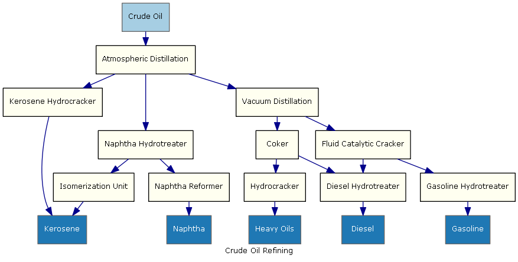
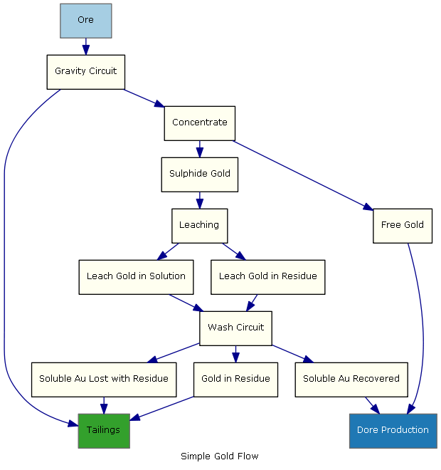
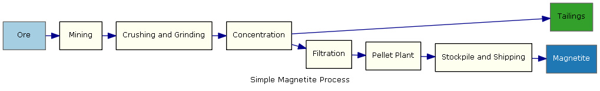

Examples
===========

Examples are provided for the following processes

* [Crude Oil](#crude-oil)
* [Gold](#gold)
* [Magnetite](#magnetite)

###[Crude Oil](./CrudeOil)

Source: [xml](./CrudeOil/ProcessFlow.xml)

===
###[Gold](./Gold)

Source: [xml](./Gold/ProcessFlow.xml)

===
###[Magnetite](./Magnetite)

Source: [xml](./CrudeOil/ProcessFlow.xml)

